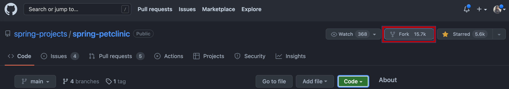
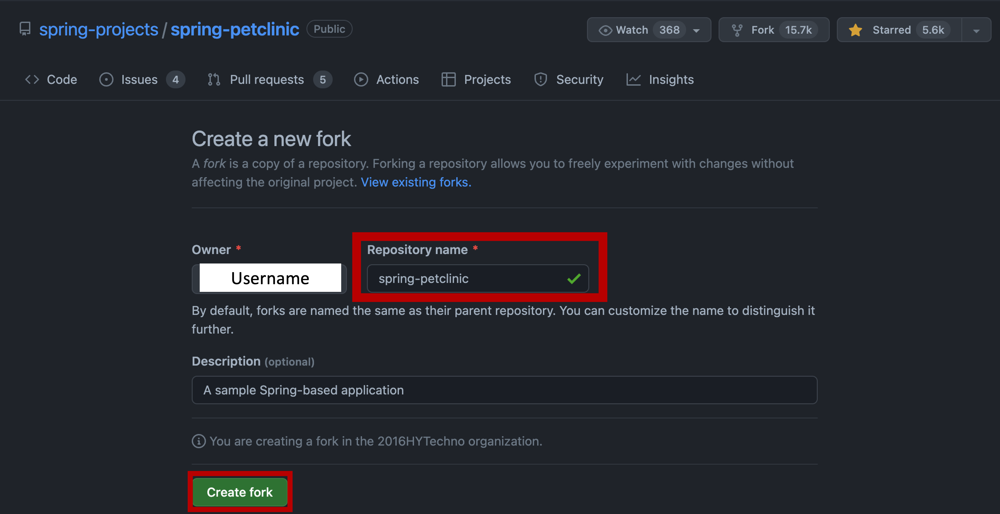
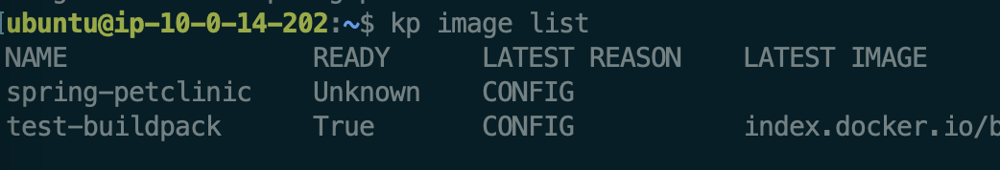
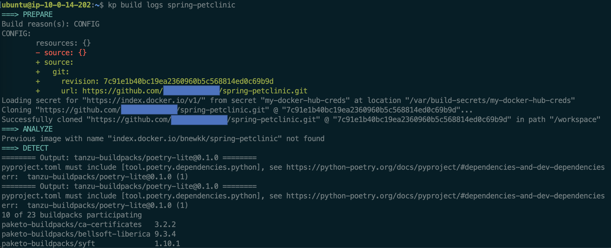
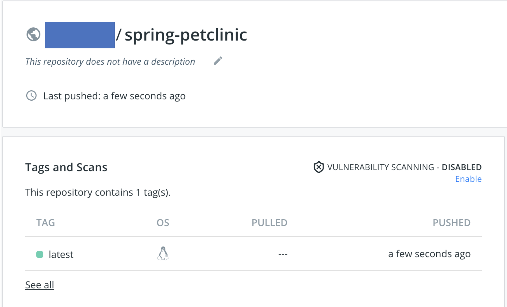
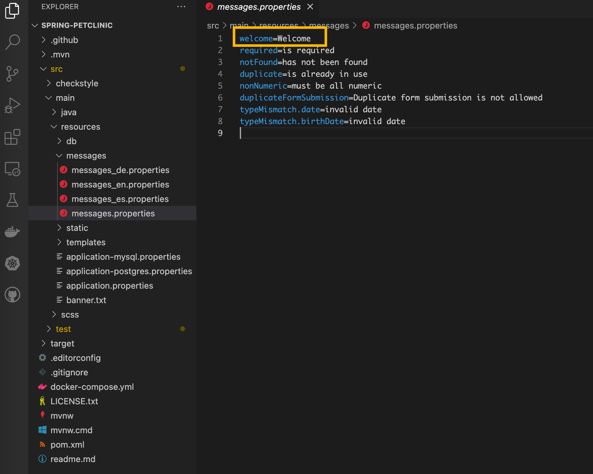
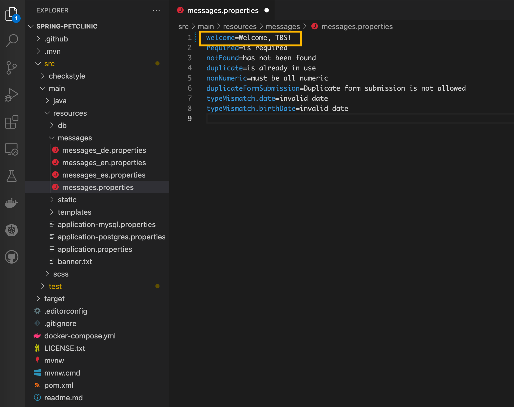
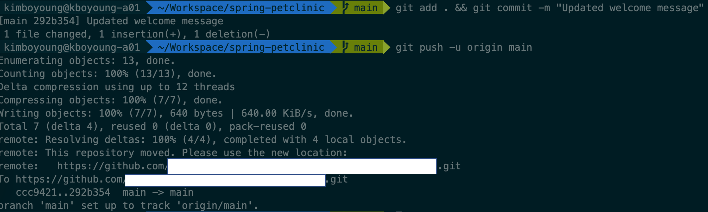
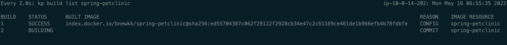
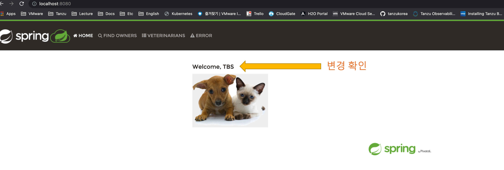

이번 Lab에서는 샘플 애플리케이션을 사용해 이미지를 Build 및 re-build 해 보겠습니다.  <br/>
예시에서는 Spring Boot 기반의 애플리케이션 및 레지스트리로 docker hub를 사용합니다. <br/><br/>

## 0. 소스코드 준비
**1) Repository Fork 하기**
<br/>이미지를 build하기 전, 본인의 git repository에 샘플 애플리케이션을 복사해 옵니다. <br/>
해당 Lab에서 사용할 애플리케이션은 spring-petclinic 이라는 Spring Boot 기반의 애플리케이션으로, 다음 주소에서 확인할 수 있습니다 <br/>
-> https://github.com/sample-accelerators/spring-petclinic


<br/>
오른쪽 상단의 fork를 클릭해 본인 repository로 복사합니다.
<br/>


**2) Repository Pull 받아오기**
<br/> 로컬에 샘플 애플리케이션 소스코드를 받아옵니다. 터미널에서 다음을 입력합니다.
```
git clone https://github.com/{Git-Username}/spring-petclinic.git
```

**주의 사항**
해당 github 레파지토리는 maven 및 gradle 빌드를 위한 builder를 모두 보유하고 있습니다. <br/>
이번 Lab에서는 Maven build를 사용할 것이므로, 이미지 build 전 clone한 github 레파지토리에서 gradle 관련 설정 파일 삭제가 필요합니다. <br/>
삭제할 항목은 다음과 같습니다 <br/>
gradle/wrapper, build.gradle, gradlew, gradlew.bat, settings.gradle
<br/>

## 1. 이미지 build
**1) Secret 생성** 
<br/> 다음 커맨드로 계정에 대한 시크릿을 생성합니다.
```
kp secret create kp-default-repository-creds --dockerhub ${INSTALL_REGISTRY_USERNAME}
```

**2) 이미지 생성**
<br/>아래와 같은 커맨드로 이미지를 생성합니다. 
- tag 옵션 : 본인의 레파지토리
- git 옵션 : 소스코드를 가져올 git 주소
- git-revision 옵션 : git branch
<br/> 옵션 확인이 필요할 경우,  kp image create -h 로 확인합니다.

```
kp image create spring-petclinic --tag index.docker.io/$DH_USERNAME/spring-petclinic --git https://github.com/$GH_USERNAME/spring-petclinic.git --git-revision main
```
<br/>

**3) 이미지 생성 과정 조회**
<br/>kp image list 입력해 생성한 이미지를 확인합니다. <br/>


kp build logs spring-petclinic 을 입력해 이미지 빌드 로그를 조회합니다. <br/>


이미지 생성 과정은 prepare -> analyze -> detect -> restore -> build -> export -> completion순서입니다. <br/>
Completion 후 Build successful 메시지를 확인합니다.

<br/>

**4) Docker Hub에서 이미지 확인**
<br/> Docker Hub에서 이미지를 확인합니다.


<br/>

**5) docker run으로 이미지 실행**
<br/> 다음 커맨드를 실행해 build된 이미지가 잘 실행되는지 확인합니다.
```
docker run -p 8080:8080 index.docker.io/{Username}/spring-petclinic:latest
```
http://localhost:8080/ 접근시 아래와 같은 화면을 확인합니다. <br/>


<br/>

## 2. 코드 수정 후 이미지 Re-build
이번 실습에서는 소스코드를 수정 후, 이미지를 다시 build 해보겠습니다.

**1) 코드 수정**
<br/> 사용중인 에디터 혹은 vi를 사용해 코드를 다음과 편집합니다. 예시에서는 VS Code를 사용했습니다.
<br/> spring-petclinic/src/main/resources/messages/messages.properties 을 확인합니다.


첫 번째 값은 현재 Welcome 이고, 이를 Welcome, TBS! 로 수정해 보겠습니다.


수정 후 코드를 저장합니다.

**2) Git Push**
<br/>수정한 코드를 add, commit, push 합니다. 커맨드는 아래와 같습니다.
```
git add . && git commit -m "Updated welcome message"
git push -u origin main
```


코드가 반영되었음을 Github에서 확인합니다.

**3) 이미지 Re-build 관찰**
<br/> 다음 커맨드를 통해 이미지가 다시 빌드되는 과정을 관찰합니다.
```
watch kp build list spring-petclinic
```


빌드 Status가 Success로 바뀔 때까지 기다립니다. 

**4) docker run으로 변경된 이미지 실행**
<br/> 위에서 사용했던 커맨드를 통해 re-build된 이미지가 잘 실행되는지 확인합니다.
```
docker run -p 8080:8080 index.docker.io/{Username}/spring-petclinic:latest
```
http://localhost:8080/ 접근시 Welcome 메시지가 변경되었음을 확인합니다. <br/>



<br/><br/>
본 실습을 성공적으로 마치셨습니다.
