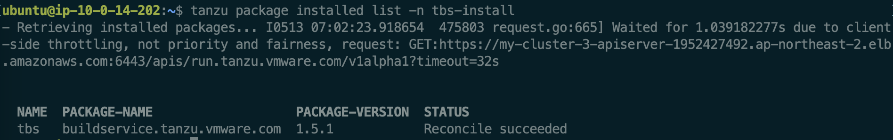
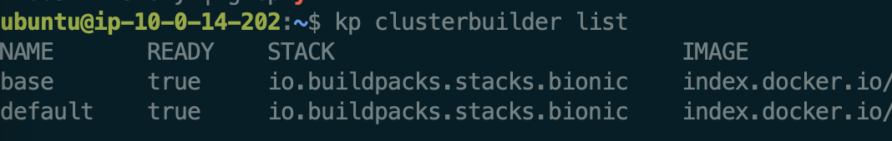

이번 Lab에서는 Tanzu Build Service를 설치해 보겠습니다. 시작 전, prerequisite을 확인해 주시기 바랍니다.
<br/><br/>

# 0. 시작 전  - 이미지 레지스트리란?
이번 Lab에서 말하는 '이미지 레지스트리'란, Kubernetes 및 Container 기반 애플리케이션 개발을 위해 컨테이너 이미지를 저장하는 데 사용되는 레파지토리 입니다. <br/>
이미지 레지스트리에는 대표적으로 Harbor와 Docker Hub가 있습니다. <br/><br/>

**1) Harbor**
- Harbor는 정책 및 역할 기반 액세스 제어로 아티팩트를 보호하고, 이미지가 스캔되고 취약성이 없는지 확인하고, 이미지를 신뢰할 수 있는 것으로 서명하는 오픈 소스 레지스트리입니다.<br/>
- CNCF Graduated Project인 Harbor는 규정 준수, 성능 및 상호 운용성을 제공하여 Kubernetes 및 Docker와 같은 클라우드 네이티브 컴퓨팅 플랫폼에서 일관되고 안전하게 아티팩트를 관리하는 데 도움이 됩니다.<br/>
- 별도의 설치가 필요하며, 다음 링크에서 자세한 정보 확인이 가능합니다 (https://goharbor.io/) <br/>

**2) Docker Hub**
- Docker Hub는 Docker에서 운영하는 Docker 이미지 저장소 서비스입니다. <br/>
- 사용자는 이미지 저장 및 공유를 위해 무료 public repository에 엑세스하고나, private repository 구독을 사용할 수 있습니다 <br/>
- 서비스 사용을 위해서는 Docker Hub 계정이 필요합니다.

# 1. Tanzu Build Service 설치
## 1. 환경 변수 설정
설치에 필요한 환경 변수를 정의합니다.
```
export INSTALL_REGISTRY_HOSTNAME=<IMAGE-REGISTRY>
export INSTALL_REPOSITORY=<IMAGE-REPOSITORY>
export INSTALL_REGISTRY_USERNAME=<REGISTRY-USERNAME>
export INSTALL_REGISTRY_PASSWORD=<REGISTRY-PASSWORD>
export TANZUNET_REGISTRY_USERNAME=<TANZUNET_REGISTRY_USERNAME>
export TANZUNET_REGISTRY_PASSWORD=<TANZUNET_REGISTRY_PASSWORD>
export TBS_VERSION=<LATEST-TBS-VERSION>
```

- IMAGE-REGISTRY : 이미지 레지스트리의 호스트 이름입니다.
- IMAGE-REPOSITORY : 이미지 레지스트리의 레파지토리입니다.
    - Dockerhub : my-dockerhub-username/build-service 혹은 index.docker.io/my-dockerhub-username/build-service
    - gcr.io : gcr.io/my-project/build-service
    - Harbor: my-harbor.io/my-project/build-service
- REGISTRY_USERNAME, REGISTRY_PASSWORD : 위 이미지 레지스트리의 ID/비밀번호 입니다.
- TANZUNET_REGISTRY_USERNAME, TANZUNET_REGISTRY_PASSWORD : TanzuNet (https://network.tanzu.vmware.com/)의 ID/비밀번호 입니다.
- LATEST-TBS-VERSION : 설치하고자 하는 TBS 버전입니다. (예시 : 1.5.1)
<br/>

## 2. 프라이빗 레지스트리에 이미지 준비
Tanzu Network에 있는 이미지를 프라이빗 레지스트리로 옮기는 과정입니다. <br/>

**1) Tanzu Registry 로그인**
```
docker login registry.tanzu.vmware.com
```

**2) Private Registry 로그인**
```
docker login ${INSTALL_REGISTRY_HOSTNAME}
```

**3) Carvel Tool의 imgpkg를 사용한 이미지 복사**
```
imgpkg copy -b registry.tanzu.vmware.com/build-service/package-repo:$TBS_VERSION --to-repo=${INSTALL_REPOSITORY}
```

(예시)
```
imgpkg copy -b registry.tanzu.vmware.com/build-service/package-repo:1.5.1 --to-repo=index.docker.io/{Username}/tbs
```

<br/>

## 3. 설치
**1) namespace 생성**
```
kubectl create ns tbs-install
```

**2) tanzu secret 생성**
```
tanzu secret registry add tbs-install-registry \
  --username ${INSTALL_REGISTRY_USERNAME} --password ${INSTALL_REGISTRY_PASSWORD} \
  --server ${INSTALL_REGISTRY_HOSTNAME} \
  --export-to-all-namespaces --yes --namespace tbs-install
```

**3) Tanzu Build Service 패키지 레파지토리 추가**
```
tanzu package repository add tbs-repository \
    --url "${INSTALL_REPOSITORY}:${TBS_VERSION}" \
    --namespace tbs-install
```

**4) 패키지 레파지토리 설치 확인**
```
tanzu package repository get tbs-repository --namespace tbs-install
```

**5) kp secret 생성**
<br/>레파지토리에 대한 kp 시크릿을 생성하는 과정입니다.
```
 kp secret create kp-default-repository-creds \
   --registry "${INSTALL_REGISTRY_HOSTNAME}" \
   --registry-user "${INSTALL_REGISTRY_USERNAME}" \
   --namespace tbs-install
```

**6) tbs-values.yml 파일 생성**

- plain text로 파일 구성
    ```
    ---
    kp_default_repository: <INSTALL_REPOSITORY>
    kp_default_repository_username: <INSTALL_REGISTRY_USERNAME>
    kp_default_repository_password: <INSTALL_REGISTRY_PASSWORD>
    pull_from_kp_default_repo: true
    tanzunet_username: <TANZUNET_REGISTRY_USERNAME>
    tanzunet_password: <TANZUNET_REGISTRY_PASSWORD>
    descriptor_name: <DESCRIPTOR_NAME>
    enable_automatic_dependency_updates: true
    ca_cert_data: <CA_CERT_CONTENTS> (optional)
    ```
- secret으로 파일 구성
    <br/>보안 위험성이 있는 경우, id/password를 직접 yaml에 삽입하는 대신 secret을 사용합니다.
    ```
    ---
    kp_default_repository: <INSTALL_REPOSITORY>
    kp_default_repository_secret:
    name: kp-default-repository-creds
    namespace: tbs-install
    pull_from_kp_default_repo: true
    tanzunet_secret:
    name: tanzunet-creds
    namespace: tbs-install
    descriptor_name: <DESCRIPTOR_NAME>
    enable_automatic_dependency_updates: true
    ca_cert_data: <CA_CERT_CONTENTS> (optional)
    ```

-  추가 설명
    - DESCRIPTOR_NAME : 옵션이 full일 경우, 모든 dependency를 포함 (production 환경). lite일 경우, 클러스터의 인터넷 접근이 필요
    - CA_CERT_CONTENTS : 레지스트리가 사설 인증서로 구성되었을 경우 필요. .PEM 파일이 필요합니다.

-  기타 설치 옵션
    - 추가적인 value schema는 아래 명령어 실행을 통해 조회 가능하며, tbs-values.yml 에 추가합니다.
    ```
    tanzu package available get buildservice.tanzu.vmware.com/$TBS_VERSION --values-schema --namespace tbs-install
    ```

tbs-values.yml 파일을 저장합니다.
<br/>

**7) 패키지 설치**
<br/>위에서 생성한 yml 파일을 통해 패키지를 설치합니다.
```
tanzu package install tbs -p buildservice.tanzu.vmware.com -v $TBS_VERSION -n tbs-install -f tbs-values.yml --poll-timeout 30m
```

설치가 완료되면 다음과 같이 확인이 가능합니다. <br/>



**8) Tanzu Build Service 설치**
<br/> 최종적으로 Tanzu Build Service를 설치합니다. descriptor name에는 위에서 사용했던 full/lite 를 적용합니다.
```
ytt -f /tmp/bundle/config/ \
	-f /tmp/ca.crt \
	-v kp_default_repository='my.registry.io/tbs' \
	-v kp_default_repository_username='my-user' \
	-v kp_default_repository_password='my-password' \
	--data-value-yaml pull_from_kp_default_repo=true \
	-v tanzunet_username='tanzunet-username' \
	-v tanzunet_password='tanzunet-password' \
	-v descriptor_name='lite' \
	--data-value-yaml enable_automatic_dependency_updates=true \
	| kbld -f /tmp/bundle/.imgpkg/images.yml -f- \
	| kapp deploy -a tanzu-build-service -f- -y
```
프라이빗 레지스트리가 아닌 docker hub 사용 시 -f /tmp/ca.crt 를 제외하고 실행합니다. <br/>
docker hub 예시는 다음과 같습니다.

```
ytt -f /tmp/bundle/config/ \
	-v kp_default_repository='index.docker.io/{username}/tbs' \
	-v kp_default_repository_username='{username}' \
	-v kp_default_repository_password='{userpassword]' \
	--data-value-yaml pull_from_kp_default_repo=true \
	-v tanzunet_username='{tanzunet-username}' \
	-v tanzunet_password='{tanzunet-password}' \
	-v descriptor_name='lite' \
	--data-value-yaml enable_automatic_dependency_updates=true \
	| kbld -f /tmp/bundle/.imgpkg/images.yml -f- \
	| kapp deploy -a tanzu-build-service -f- -y
```

**9) 설치 최종 확인**
<br/>다음 커맨드를 입력합니다.
```
kp clusterbuilder list
```
설치가 성공적으로 이루어지면 다음과 같은 화면을 확인할 수 있습니다. <br/>


<br/>

본 실습을 성공적으로 마치셨습니다.
<br/><br/>


# 2. Air-Gapped 환경에서 Tanzu Build Service 설치
To Be Updated


본 실습을 성공적으로 마치셨습니다.